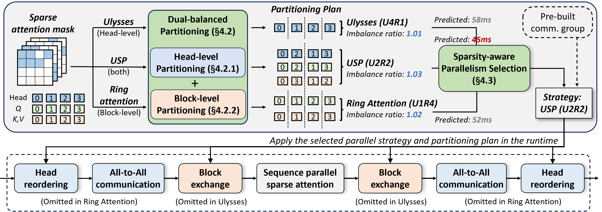

# db-SP: Dual-Balanced Sequence Parallelism for Sparse Attention in Visual Generative Models

<!-- [](https://anonymous.4open.science/r/Dual-balance-3ECE)  
[](https://anonymous.4open.science/r/Dual-balance-3ECE) -->

This repository contains the official implementation of **_db_-SP**, a sparsity-aware sequence parallelism technique designed to accelerate sparse attention in visual generative models (e.g., Diffusion Transformers).  
By addressing workload imbalance at both the **head level** and **block level**, _db_-SP achieves significant speedups in both attention computation and end-to-end inference latency.

## 🚀 Overview

Visual generative models like Diffusion Transformers (DiTs) rely heavily on self-attention, which becomes a bottleneck due to its quadratic complexity. While block-wise sparse attention reduces computation, existing sequence parallelism methods (e.g., Ulysses, Ring Attention) suffer from severe workload imbalance when applied to sparse masks.

**_db_-SP** introduces:
- A **dual-balanced partitioning** method that balances workload across GPUs at both head and block levels
- A **sparsity-aware strategy selection** mechanism that dynamically chooses the optimal parallel strategy per layer
- Minimal overhead through **partitioning reuse** and **biased greedy algorithms**

### Key Results
- **1.25×** end-to-end speedup  
- **1.40×** attention speedup  
- Near-perfect workload balance with **<5% overhead**

## 🧩 Method Highlights

### Dual-Balanced Partitioning
- **Head-Level**: Greedy assignment of attention heads to GPUs based on dense block counts
- **Block-Level**: Biased greedy partitioning of Q/K/V chunks with reward factor \( R_b \) to minimize inter-GPU communication

### Sparsity-Aware Strategy Selection
- Dynamically predicts the optimal parallel strategy (Ulysses, Ring Attention, or hybrid) per layer using a latency model
- Pre-builds communication groups to eliminate runtime overhead

### Overhead Mitigation
- Reuses partitioning plans across denoising steps via similarity threshold \( P_s \)
- Overlaps communication with computation to hide latency

## 📦 Installation

> 🔧 *This section will be updated once the code is fully organized.*

### Dependencies
- Python 3.8+
- PyTorch 2.5.1+
- CUDA 12.1+
- NCCL 2.21.5+


- PAROAttention
- SpargeAttn


### Install from Source
```bash
git clone https://anonymous.4open.science/r/Dual-balance-3ECE
cd db-SP
pip install -e .
